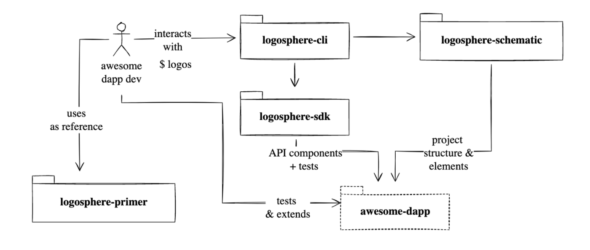

# logosphere
Layer 2 data sharing ecosystem for Cardano

## Setup

These projects use pnpm for package management.  The `logosphere-cli` project depends upon the `logosphere-sdk` project so it needs to be linked.  

Similarly the `logosphere-primer` project depends on the `logosphere-cli` and `logosphere-schematics` projects.  Therefore those projects must also be linked.  

The easiest way to setup the projects is to follow these three steps:
1. Install [pnpm](https://pnpm.io/installation)
2. $ `pnpm run build`
3. $ `mv logos /usr/local/bin/`
