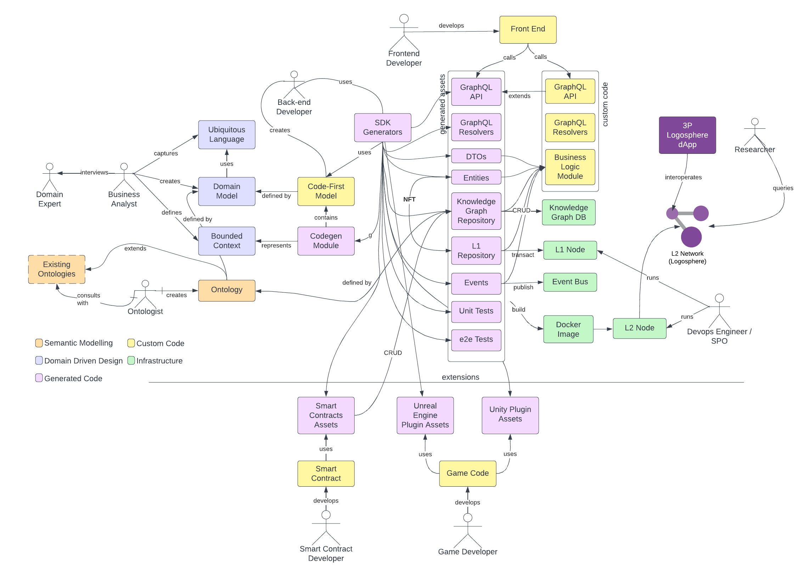

# Logosphere

Logosphere provides framework for building interoperable decentralized applications (dApps), that will support use cases of asset tokenization in a particular business domain. The assets will be tokenized as NFTs in L1 and have dynamic metadata properties defined in Logosphere, which will be queryable and interoperable via global interconnected knowledge graph of metadata potentially spanning multiple L1 ecosystems.

Logosphere conforms to Data Mesh Architecture concepts and consists of the following components:
- Domain-agnostic framework that takes domain model as an input and produces domain-specific generated code with following functionality:
  - CRUD (Create, Read, Update, Delete) operations against variety of data persistence layers, operational and analytical
  - Persistence of metadata into semantic knowledge graph in Fluree DB
  - Instrumentation for creating & signing transactions into Logosphere with simultaneous linking of metadata in Logosphere through hashes
  - Generated GraphQL API with commonly CRUD queries and mutations
  - Generated library of assets, such as entities, value objects, data transfer objects, mappers & repositories that conform to established patterns and ready to be used in custom business logic of the dApp
- Extensions / plugins for specific use cases and languages such as generating assets for gaming engines (Unreal Engine & Unity in C++ and C#), smart contract libraries (Cardano Plutarch) that would allow to use metadata stored in the knowledge graph directly from the supported codebase.
- Verifiability of metadata provenance
- Deployability of Logosphere node with a set of microservices, able to interoperate with microservices published by another Logosphere dApps.
- Focus on quality of data persisted in the knowledge graph which should be distilled from operational data according to the rules defined by the domain team.

## Logosphere Conceptual Model


- Business Analyst interviews Domain Expert
  - captures Ubiquitous Language
  - creates Domain Model
- If Domain Model is complex, Business Analyst divides it into Bounded Contexts (sub-domains)
- Ontologist uses Domain Model and creates an Ontology
  - consults with existing ontologies
  - extends ontological model
- Backend Developer uses Domain Model and Bounded Contexts to generate one or more Codegen Modules using Logosphere SDK
  -  For each Codegen Module creates Code-First Model
  - Generates Federated GraphQL API and the following assets of Domain Driven Design methodology
    - Data Transfer Objects (DTOs)
    - Entities
    - Repositories
    - Events
    - Unit Tests
    - End-to-end (e2e) Tests
- Logosphere SDK provides domain-agnostic templates and code generators, as well as libraries for connecting to centralized and decentralized infrastructure
- Backend Developer writes code for custom Business Logic Module utilizing generated by Logosphere SDK assets
  - Extends GraphQL API with custom queries and mutations
  - For each module builds docker image
- DevOps Engineer publishes docker image as a microservice in Logosphere node hosted on Kubernetes
  - Maintains L1 node running on the same k8s infrastructure
- Frontend Developer uses backend exposed as a GraphQL API and builds application frontend
- 3rd-party application connects to the Knowledge Graph using interoperability standards defined in W3C semantic web protocols: SPARQL language, ontologies etc and is able to retrieve metadata defined by any project that conforms to the same set of standards
- Researcher utilizes SPARQL to query Knowledge Graph DB to look for insights in areas of their interest
- Game Developer uses Logosphere Plugins for Unreal Engine and Unity to generate in-game assets and have them minted and transacted on L1 with metadata persisted in Logosphere
- Knowledge Graph DB guarantees metadata consistency, verifiability, provenance & security. For Logosphere we are using Fluree DB 

# Trying Logosphere
## Pre-requisites
Installing required pre-requisites
### NodeJS
Install latest version of NodeJS. The tested version at the time of writing this document is 16.18.1

### PNPM
PNPM is a fast, efficient package manager, 2x faster than NPM. 
```
npm install -g pnpm@6.35.0
```
The latest version of PNPM is 7.x but it has an issue with linking packages using pnpm link useful for local development of `@logosphere` libraries. Therefore it's better to stick to the latest `6.x` version. The  is logged to track this and once fixed, we should be switching to `7.x` because `6.x` is becoming unsupported.

Turn on peer dependencies auto-install:
```
pnpm config set auto-install-peers true
```
### NX
NX is a next generation build system with first class monorepo support and powerful integrations.
```
pnpm install -g nx@15.4.4
```

### PNX Alias
Try running nx command from the workspace directory and it will give you warning:

>NX Running global Nx CLI with PNPM may have issues.
Prefer to use "pnpm" (https://pnpm.io/cli/exec)) to execute commands in this workspace.
TIP create a shortcut such as: alias pnx="pnpm nx --"

As it says in the tip, create a alias in your `.bash_profile` or `.zshrc` (MacOs only) depending on what shell you are using
```
alias pnx="pnpm nx"
```
Source it
```
$ source ~/.zshrc
```
Try it
```
$ pnx --version
```
Now the warning about using pnpm should be gone.
From now on, when following instructions from Nx documentation, whenever it says to use `nx` use `pnx` alias instead

### Docker
Install latest version of Docker Desktop, which should include `docker-compose`

## NX workspace
Creating empty NX workspace and initializing it with project

### Create new NX workspace
```
npx create-nx-workspace@15.4.4 --name ls-primer --pm pnpm --nxCloud false --preset empty
cd ls-primer
```
### Install Logosphere SDK
```
pnpm install @logosphere/sdk@latest
```
### Install Nx Node plugin
```
pnpm install @nrwl/node@15.4.4 @types/node @babel/core
```
### Init Workspace
```
pnx g @logosphere/sdk:init
```
Ignore all the warnings. At this point you should have an empty NX workspace with all the required dependencies installed.

The init operation only runs once on a newly created empty NX workspace. If you invoke init again, it will not do anything. 

If you want to start from scratch, delete the workspace first and then create it again. 

## Creating Music Microservice
Follow the documentation
https://docs.logosphere.io/v/sdk/sdk-primer/music-module

# FAQ
## What is the meaning of word Logosphere?
Logosphere is a term coined by a Russian philosopher Mikhail Bakhtin and means an adaptation of the concepts biosphere and noosphere: logosphere is derived from the interpretation of words' meanings, conceptualized through an abstract sphere.
Logosphere is based on two words (logos + sphere), where logos (λόγος) is a Greek word meaning “word”, “reason” or “plan”. It appears in the first passage of the New Testament:
“In the beginning was logos” - John (1:1)

## What is domain driven design? 
Domain-driven design (DDD) is a major software design approach, focusing on modeling software to match a domain according to input from that domain's experts.

Under domain-driven design, the structure and language of software code (class names, class methods, class variables) should match the business domain. For example: if software processes loan applications, it might have classes like "loan application", "customers", and methods such as "accept offer" and "withdraw".

Domain-driven design is predicated on the following goals:

- placing the project's primary focus on the core domain and domain logic;
- basing complex designs on a model of the domain;
- initiating a creative collaboration between technical and domain experts to iteratively refine a conceptual model that addresses particular domain problems.

### What is Data Mesh Architecture?

A data mesh is a decentralized data architecture that treats each dataset as a data product and organizes data by a specific business domain, providing more ownership to the producers of a given dataset.

